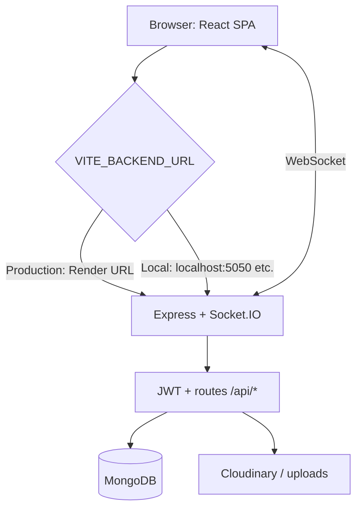
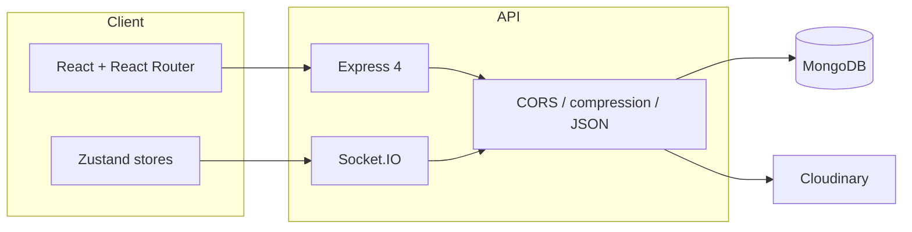

<div align="center">

# Blah Blah

### Chat, calls, and creativity in one place.

A **full-stack real-time chat app**: message friends, accept chat requests, jump on **audio/video calls**, and use **notes, drawing, watch-together, and games**—with **Socket.IO** live updates and a **themeable** UI.

<br>


<br>


<br><br>

**Real-time messaging. Rich sidebar. Deployed when you are.**

</div>

---

## What is Blah Blah?

Blah Blah is a **split frontend/backend** project: a **React + Vite** client and an **Express + MongoDB** API wired with **Socket.IO**. It supports:

- **Accounts** — sign up / login with **JWT** (Bearer token) and optional cookie flow
- **Conversations** — create chats, **request / accept / reject**, friends list
- **Live messaging** — Socket.IO for delivery, typing, calls, and features like drawing sync
- **Media & profile** — avatars (e.g. Cloudinary), encrypted message fields where implemented
- **Extras** — notes, shared drawing canvas, watch party, truth-or-dare, **Chat DNA** insights (charts)
- **REST API** under `/api` — `auth`, `messages`, `conversations`, `notes`, `drawings`, `chat-dna`, `watch-party`, and more

---

## Core features

<div align="center">

| Chat & social | Realtime & calls | Productivity & fun |
| ------------- | ---------------- | ------------------ |
| Chat list, search, unread badges | Socket.IO rooms & events | Per-chat notes |
| Friend requests & accept/reject | Audio / video calling flow | Collaborative drawing |
| User codes for adding people | Online presence | Watch together & mini-games |
| Profile & theme (light/dark) | Timed / scheduled messages | Chat analytics (Recharts) |

</div>

<br>

<div align="center">

| API & security | Deploy & CORS | Dev experience |
| -------------- | ------------- | ---------------- |
| bcrypt passwords, JWT | CORS for Vercel + `*.vercel.app` previews | Root script runs both apps |
| Role-style data model (participants) | Compression + health route | ESLint on frontend |
| MongoDB + Mongoose | Env-driven `FRONTEND_URL` / `CORS_ORIGINS` | HTTPS dev via mkcert (Vite) |

</div>

---

## Application gallery

Screenshots live in the **`Photos/`** folder. Paths below are URL-encoded for spaces (GitHub-safe).

<div align="center">

<table>
<tr>
<td></td>
<td></td>
</tr>
<tr>
<td></td>
<td></td>
</tr>
<tr>
<td></td>
<td></td>
</tr>
<tr>
<td></td>
<td></td>
</tr>
</table>

</div>

---

## Request flow (high level)



### Explanation

1. **Client** — Vite dev server or Vercel static build; API base is `VITE_BACKEND_URL` + `/api` (see `frontend/src/lib/axios.js`).
2. **API** — Express serves REST and attaches **Socket.IO** on the same HTTP server.
3. **Auth** — Token stored client-side (e.g. `localStorage`) with `Authorization: Bearer` on axios; `withCredentials` for cookies when used.
4. **Data** — Mongoose models; optional **Cloudinary** for profile images and rich payloads.

---

## System architecture



### Stack notes

- **Frontend** — React 18, Vite, JavaScript, Tailwind CSS, DaisyUI, Lucide icons, Recharts, react-hot-toast.
- **Backend** — Express, Mongoose, Socket.IO, JWT, bcryptjs, cors, compression, Cloudinary, optional OpenAI / Google AI for bot features.
- **Deploy** — Frontend on **Vercel**; API on **Render** (or any Node host). Set **`VITE_BACKEND_URL`** on the client and **`FRONTEND_URL` / `CORS_ORIGINS`** on the server so production and **Vercel preview** domains are allowed.

---

## Getting started

### Prerequisites

- **Node.js 18+**
- **MongoDB** (Atlas or local)

### Clone & install

```bash
git clone https://github.com/YOUR_USERNAME/Blah-Blah.git
cd Blah-Blah
npm install
npm install --prefix backend
npm install --prefix frontend
```

### Environment

Create **`backend/.env`** (example keys — adjust to your setup):

| Variable | Purpose |
| -------- | ------- |
| `MONGO_URI` | MongoDB connection string |
| `JWT_SECRET` | Signing secret for JWT |
| `PORT` | Server port (Render sets this automatically) |
| `FRONTEND_URL` | Primary site origin(s), comma-separated |
| `CORS_ORIGINS` | Extra allowed origins |
| Cloudinary keys | If using Cloudinary uploads |
| `OPENAI_API_KEY` / Google AI | If using AI / bot features |

Create **`frontend/src/lib/.env`** (or Vite env as you prefer):

| Variable | Purpose |
| -------- | ------- |
| `VITE_BACKEND_URL` | API origin **without** `/api` (e.g. `https://your-api.onrender.com`) |

### Run full stack (development)

From the repo root:

```bash
npm run dev
```

Runs **backend** (nodemon) and **frontend** (Vite) together via `concurrently`.

### Other useful commands

```bash
npm run dev:backend    # API only
npm run dev:frontend   # Vite only
npm run build          # Install deps + production build of the frontend
npm run start          # Start API (production-style)
npm run lint --prefix frontend
```

---

## Project structure

| Path | Purpose |
| ---- | ------- |
| `frontend/` | React + Vite SPA (`src/`, `public/`) |
| `backend/` | Express API (`src/`, `src/lib/socket.js`, routes, models) |
| `Photos/` | README gallery screenshots |
| `package.json` | Root scripts to run both apps |

---

## Roadmap ideas

- Push notifications for new messages
- Message search across chats
- E2E tests for auth and chat flows
- Optional admin moderation tools
- File attachments polish & virus scanning

---

<div align="center">

## Author

**[Ajyendu](https://github.com/Ajyendu)**

If this project helps you, consider giving the repo a star.

</div>
